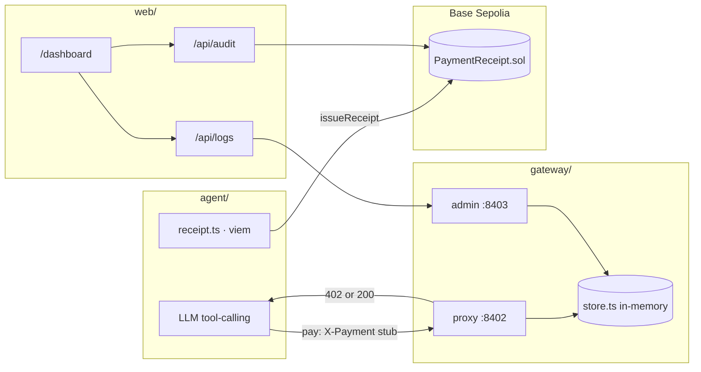

aaaaa# X-Gate · On-Chain Micropayment API Gateway

> **Baseline stack for AI × paid APIs** — x402 HTTP gateway, LLM pay/skip agent,
> on-chain decision receipts, and a dual-view dashboard.

**One-liner:** Cloudflare-like payment gateway + autonomous spending-policy agent + verifiable receipts on Base Sepolia.

---

## Quick Links

| | Link |
|---|------|
| **Dashboard (local)** | `http://localhost:3000/dashboard` |
| **Landing (local)** | `http://localhost:3000/` |
| **Contract (Base Sepolia)** | [PaymentReceipt on Basescan](https://sepolia.basescan.org/address/0x2d29bFa1bd917CB38D9CE796BE40073B080AAbB0) |

> Use your own contract address after Remix deploy. Run `npm run scenarios`, then open
> **Dashboard → On-Chain Audit** for clickable TX links.

---

## 1 · Problem & Users

| Persona | Pain |
|---------|------|
| **API provider** | Public APIs get scraped for free; per-call billing is heavy to build |
| **Agent operator** | Autonomous agents can overspend on low-value or duplicate calls with no audit trail |

**X-Gate baseline**

- **Providers** — put any HTTP API behind the gateway; unpaid traffic gets `402 Payment Required` (x402).
- **Agents** — LLM applies budget / rate / intent rules and chooses **pay or skip** before calling the gateway.
- **Audit** — pay **and** skip decisions are written on-chain (`PaymentReceipt.sol`), not only in local logs.

---

## 2 · Solution

Three independent npm packages (not a monorepo):

| Package | Role |
|---------|------|
| `gateway/` | Reverse proxy (`:8402`) + admin API (`:8403`) |
| `agent/` | LLM scenario runner + on-chain receipts |
| `web/` | Next.js 15 landing + dashboard |

**Highlight:** A **skip** decision (agent declines to pay) is still recorded on-chain as `skip|reason` — not just successful payments.

---

## 3 · Architecture



**Pay flow**

1. LLM calls `approve_payment` → GET with stub `X-Payment` header.
2. Gateway stub-verifier accepts → JSON response (builtin demo API or upstream).
3. Agent writes `issueReceipt(payee, amount, "pay|…")` on Base Sepolia.
4. Dashboard **On-Chain Audit** shows the event with Basescan links.

**Skip flow** — no HTTP to gateway; agent still writes `skip|…` on-chain.

---

## 4 · Demo

### Prerequisites

- Node.js 20+
- `LLM_API_KEY` (DeepSeek or any OpenAI-compatible API)
- Base Sepolia wallet + deployed `PaymentReceipt.sol` (optional; required for Audit tab)

### Quick run

```bash
# Terminal 1 — gateway
cd gateway && cp .env.example .env && npm install && npm run dev

# Terminal 2 — dashboard
cd web && cp .env.local.example .env.local && npm install && npm run dev

# Terminal 3 — one pay case (gateway must be running)
cd agent && cp .env.example .env   # LLM_API_KEY + PAYMENT_RECEIPT_ADDRESS
npm install && npm run scenarios -- --case=1
```

Open `http://localhost:3000/dashboard` → **On-Chain Audit**.

> **Port conflicts:** set `PROXY_PORT` / `ADMIN_PORT` in `gateway/.env` and matching
> `GATEWAY_ADMIN_URL` in `web/.env.local` (e.g. `8412` / `8413`).

### Agent scenarios (5 cases)

| # | Name | Expected | Rule tested |
|---|------|----------|-------------|
| 1 | `high-value-first-call` | **pay** | Clear intent + budget OK |
| 2 | `hourly-limit-hit` | **skip** | `callsThisHour >= maxCallsPerHour` |
| 3 | `budget-nearly-empty` | **skip** | `remainingDailyUSDC < 0.05` |
| 4 | `duplicate-within-cooldown` | **skip** | Same URL paid within `cooldownSec` |
| 5 | `intent-path-mismatch` | **skip** | Intent doesn't match API path |

### Mechanical demo (no LLM)

```bash
cd gateway && npm run demo   # 10 requests, 5 with fake X-Payment
```

Shows traffic in **Dashboard → Gateway Live** (HTTP hits only; skip cases do not appear there).

---

## 5 · Tech Stack

| Layer | Implementation |
|-------|----------------|
| **Gateway** | Node.js, TypeScript, [x402](https://www.x402.org/) 402 JSON, route-based pricing |
| **Agent** | OpenAI SDK (DeepSeek default), tool-calling, viem 2.21 |
| **Web** | Next.js 15, Tailwind v4, recharts, SSE, server-side viem `getLogs` |
| **Chain** | Base Sepolia — `PaymentReceipt.sol`, `MockUSDC.sol` (Remix deploy) |

**Design constraints**

- No database — gateway stats are in-memory and reset on restart.
- Testnet only — do not commit `.env` or use mainnet keys.
- Each package installs and runs independently.

---

## 6 · What Ships Today

### `gateway/`

| Feature | Detail |
|---------|--------|
| x402 402 | Unpaid `/api/*` → JSON payment instructions (`payTo`, `amount`, `asset`) |
| Route pricing | `/api/premium/*` vs `/api/*` rules in `config.ts` |
| Free paths | `/bypass`, `/health` pass through without payment |
| Stub verifier | Accepts any `0x…` `X-Payment` header (demo mode) |
| Builtin demo API | `BUILTIN_API=true` — local JSON for `/api/*` (no httpbin dependency) |
| Admin API | `GET /stats`, `GET /logs` — paid / blocked / free counters + request log |
| Mechanical demo | `npm run demo` — scripted traffic |

### `agent/`

| Feature | Detail |
|---------|--------|
| LLM decisions | `approve_payment` / `decline_payment` tools with 7 policy rules |
| Stub pay mode | `AGENT_DEMO_MODE=stub` — fake `X-Payment`, no USDC transfer |
| Scenario runner | `npm run scenarios` — 5 cases, `--case=N` for single run |
| On-chain receipt | `issueReceipt()` after every pay **and** skip |
| Memo format | `pay\|reason` or `skip\|reason` (max 100 chars) |

### `web/`

| Feature | Detail |
|---------|--------|
| Landing | `/` — how it works + demo commands |
| Dashboard | `/dashboard` — two tabs in one view |
| Gateway Live | SSE poll of admin `/stats` + `/logs`; 60s traffic chart |
| On-Chain Audit | Fetches `ReceiptIssued` events; Basescan links; 60s refresh |
| Filter | Optional `NEXT_PUBLIC_AGENT_ADDRESS` to filter by payer |

### `contracts/`

| Contract | Purpose |
|----------|---------|
| `PaymentReceipt.sol` | `issueReceipt(payee, amount, memo)` + `ReceiptIssued` event |
| `MockUSDC.sol` | Testnet USDC for manual payment experiments |

---

## 7 · Roadmap

| Phase | Item | Status |
|-------|------|--------|
| M1 | Gateway x402 + admin stats + builtin demo API | ✅ |
| M2 | Agent LLM scenarios (5 cases) + stub pay | ✅ |
| M3 | `PaymentReceipt.sol` + Audit dashboard tab | ✅ |
| M4 | Landing + dual-tab dashboard | ✅ |
| M5 | Real USDC verifier in `gateway/verifier.ts` | ⬜ |
| M6 | `AGENT_DEMO_MODE=live` — real x402 payment flow | ⬜ |
| M7 | Public deploy (Vercel) + one-command demo script | ⬜ |
| M8 | E2E tests + CI | ⬜ |

---

## 8 · Reference

### Packages & ports

| Package | Port | Role |
|---------|------|------|
| `gateway` | 8402 | x402 reverse proxy |
| `gateway` | 8403 | Admin `/stats`, `/logs` |
| `web` | 3000 | Landing + dashboard |
| `agent` | — | Outbound LLM client |

### Environment variables

<details>
<summary><code>gateway/.env</code></summary>

| Key | Description |
|-----|-------------|
| `UPSTREAM_URL` | Upstream API (default: httpbin.org) |
| `GATEWAY_WALLET` | `payTo` in 402 responses |
| `PROXY_PORT` / `ADMIN_PORT` | Default `8402` / `8403` |
| `BUILTIN_API` | `true` — local JSON for `/api/*` |

</details>

<details>
<summary><code>agent/.env</code></summary>

| Key | Description |
|-----|-------------|
| `LLM_API_KEY` | Required for scenarios |
| `LLM_BASE_URL` / `LLM_MODEL` | Default: DeepSeek |
| `GATEWAY_BASE_URL` | Default: `http://localhost:8402` |
| `AGENT_DEMO_MODE` | `stub` (default) |
| `WALLET_PRIVATE_KEY` | Testnet — signs receipts |
| `PAYMENT_RECEIPT_ADDRESS` | Deployed contract |
| `PAYEE_ADDRESS` | Gateway wallet on pay decisions |

</details>

<details>
<summary><code>web/.env.local</code></summary>

| Key | Description |
|-----|-------------|
| `GATEWAY_ADMIN_URL` | Must match gateway `ADMIN_PORT` |
| `NEXT_PUBLIC_GATEWAY_ADMIN_URL` | Shown in Live tab |
| `NEXT_PUBLIC_CONTRACT_ADDRESS` | Required for Audit tab |
| `NEXT_PUBLIC_AGENT_ADDRESS` | Filter by payer (optional) |
| `NEXT_PUBLIC_DEPLOY_BLOCK` | Faster log scan (optional) |
| `NEXT_PUBLIC_BASE_SEPOLIA_RPC` | Default: public Base Sepolia RPC |
| `NEXT_PUBLIC_EXPLORER_URL` | Default: sepolia.basescan.org |

</details>

### Commands

```bash
cd gateway && npm run dev | start | demo | typecheck
cd agent   && npm run scenarios | npm run scenarios -- --case=1 | typecheck
cd web     && npm run dev | build | typecheck
```

### Related

- [pay-gate](https://github.com/rgtang/pay-gate) — complementary AI client side (x-gate is the gateway side)

---

## License

MIT · Base Sepolia testnet · stub payment demo — **not production-ready**.
