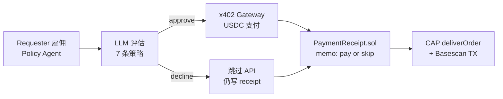
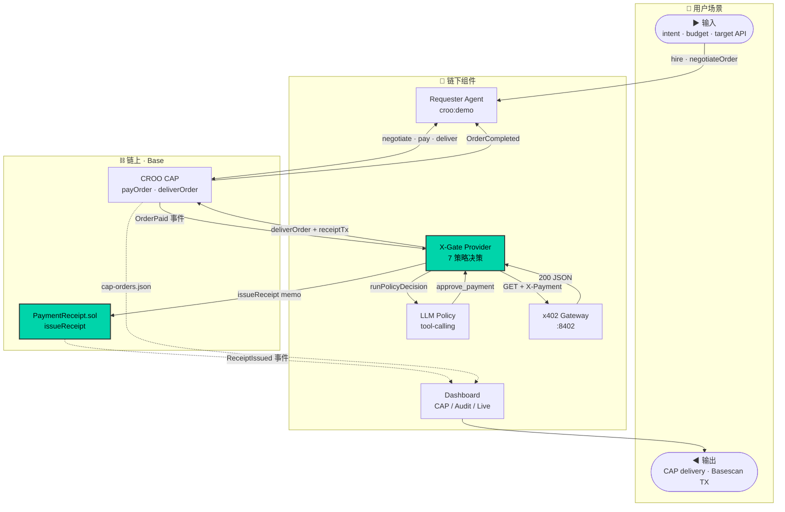
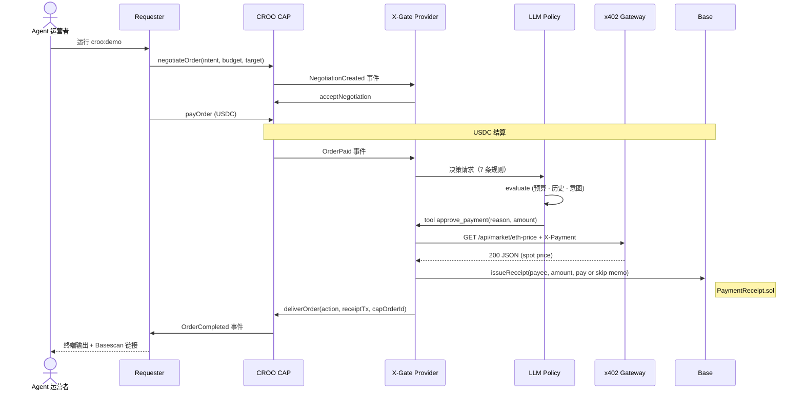

# X-Gate

> **当 AI Agent 拒绝付款时，谁来担责？**  
> X-Gate 给你答案：Pay 和 Skip **都写链上** —— 让每一个 0.001 USDC 的决策有据可查。


**🎯 [Live Demo](https://x-gate.vercel.app/dashboard)** · **📊 [Basescan 链上证明](https://basescan.org/address/0xA1D71Fa6929D9f0605De6548f00c281a2EB40d6E)** · **🏪 [CROO Agent Store](https://agent.croo.network)**

---

## 💡 核心创新：Skip 也会上链

传统 Agent 付费决策：**只有成功付款才有记录，拒绝请求消失在本地日志。**

**X-Gate 的突破：**


| 场景              | 行为                                        | 链上证明                                                                                                    |
| --------------- | ----------------------------------------- | ------------------------------------------------------------------------------------------------------- |
| 💸 **LLM 批准付款** | 走仿x402-inspired 网关 → USDC 支付 → API 调用     | [Pay TX ↗](https://basescan.org/tx/0x2d910c72213c10d8e5f0c3dfd790d083836f25adeb4206bc517d7400be78ee28)  |
| 🛑 **LLM 拒绝付款** | **不调 API，仍然 `deliverOrder` + 链上 receipt** | [Skip TX ↗](https://basescan.org/tx/0x8778474d9cb940226bca2b60a7822aed24dbc2403276ba2187f15cf5f2380d23) |


**为什么重要？** 自主 Agent 批量调 API 时，预算失控 / 重复请求 / 拒绝决策无法追溯。X-Gate 让 **每个决策留痕**，Audit Dashboard 5 秒对照 CAP 订单与 Basescan。

---

## ⚡ 评委 30 秒验收清单

```bash
# 终端看 CAP 闭环
npm run croo:demo

# 浏览器验证双路径
open https://x-gate.vercel.app/dashboard
```

**验收要点：**

- ✅ Agent Store 可见 `X-Gate Policy Agent`（Active）
- ✅ 终端输出 `OrderCompleted` + delivery JSON
- ✅ Dashboard **CAP Orders Tab**：action + receiptTx 链接
- ✅ Dashboard **Audit Tab**：Pay 和 Skip **都能点开 Basescan**

---

## 🎯 Problem → Solution

### 行业现状的盲区

**Who：** Agent 运营者 + API 提供商  
**Pain Point：**  

- Agent 批量调付费 API → 预算失控、重复请求无法追责  
- 行业默认 **只记成功付款**，Skip 决策消失在本地日志  
- CAP 下单后，「这 0.001 USDC 该不该花」谁负责？

### X-Gate 解法（3 步闭环）




**关键特性：**

1. **LLM Policy：** 7 条规则（预算上限、重复检测、意图匹配…） + tool-calling
2. **仿x402-inspired Gateway：** 任意 HTTP API 按路由 micropay，与 CAP 订单解耦
3. **链上 Receipt：** Pay **和** Skip 均写 Base，Dashboard 实时对照

---

## 📹 Demo & Quick Start


| 资源            | 状态                                                       |
| ------------- | -------------------------------------------------------- |
| **Live Demo** | [x-gate.vercel.app](https://x-gate.vercel.app/dashboard) |
| **Demo 视频**   | *录制中 · [脚本在此](docs/demo-script.md)*                      |


### 5 分钟本地跑通

```bash
# T1: 启动 x402 Gateway
cd gateway && npm run dev

# T2: 启动 Provider Agent
cd agent && npm run croo:provider

# T3: 跑 CAP 闭环（Pay 路径）
cd agent && npm run croo:check && npm run croo:demo

# 对照 Skip 路径
CROO_DEMO_CASE=skip npm run croo:demo
```

**验收输出：**  
→ 终端显示 `OrderCompleted`  
→ Dashboard **CAP Orders**：action + receiptTx  
→ Dashboard **Audit**：[Pay TX](https://basescan.org/tx/0x2d910c72213c10d8e5f0c3dfd790d083836f25adeb4206bc517d7400be78ee28) + [Skip TX](https://basescan.org/tx/0x8778474d9cb940226bca2b60a7822aed24dbc2403276ba2187f15cf5f2380d23)

---

## 🏗️ Architecture

### 系统全局图




**虚线** = 链上事件索引 / 文件日志  
**实线** = HTTP / LLM 调用  
**绿色高亮** = X-Gate 核心创新点

### Pay 路径时序图（Skip 类似，无 Gateway 调用）




**Skip 路径差异：** LLM → `decline_payment` → 跳过 Gateway → 仍 `issueReceipt(skip|reason)` + `deliverOrder`

详细文档：[architecture.md](docs/architecture.md) · [policy-rules.md](docs/policy-rules.md)

---

## 🛠️ Tech Stack


| 层级           | 技术选型                               | 为什么选它                                     |
| ------------ | ---------------------------------- | ----------------------------------------- |
| **Agent 协议** | CROO CAP · `@croo-network/sdk`     | A2A 协商/结算/交付；Policy Agent 可上架 Agent Store |
| **执行层**      | 仿x402-inspired HTTP 402 + verifier | 任意 HTTP API 按路由 micropay；与 CAP 订单解耦       |
| **链**        | Base · viem 2 · PaymentReceipt.sol | 与 CROO 同链；Circle USDC；低 gas 适合高频 receipt  |
| **策略**       | OpenAI SDK · tool-calling          | 可解释 pay/skip 决策；多条规则可审计                   |
| **前端**       | Next.js 15 · SSE                   | 三 Tab 实时对照 CAP 与链上事件                      |


### 为什么这些 Sponsor Stacks？


| Sponsor                | X-Gate 用了什么                                                               | 为什么是它                                       |
| ---------------------- | ------------------------------------------------------------------------- | ------------------------------------------- |
| **CROO · CAP**         | `negotiateOrder` → `payOrder` → `deliverOrder` 双 Agent Provider/Requester | 赛事要求 A2A 可雇佣 Agent 我们补「花钱前策略 + 花钱后 receipt」 |
| **Base · Coinbase L2** | 合约 + CAP USDC + `issueReceipt` 均在 Base                                    | 与 CROO 同链；USDC 原生 评委 5 秒 Basescan 验证        |
| **仿x402-inspired**     | Gateway 返回 402 JSON；`X-Payment` stub/live                                 | HTTP 原生 micropay 标准 可被任意 CAP 消费者复用          |


设计约束详见：[architecture.md § 设计约束](docs/architecture.md#设计约束)

---

## 🚀 Why Now · Why Us

**市场时机：**  
Agent 批量调外部 API 成为常态；Agent Store 让「雇佣专用 Agent」可行。x402-inspired 网关让按次 HTTP 付费可能，**但缺与 CAP 订单绑定的 Policy + Receipt 标准件。**

**竞争差异：**


| 维度          | X-Gate                     | 常见 CAP demo       |
| ----------- | -------------------------- | ----------------- |
| **Skip 处理** | deliver + 链上 `skip|reason` | 仅本地日志 / 无 deliver |
| **定位**      | 运行时 spending policy        | 工具链 / scaffold    |
| **验证**      | 双 TX 样本 + Dashboard 三 Tab  | 仅终端日志             |


---

## 📊 Roadmap

### ✅ Done（已交付 · 可验证）


| 交付物         | 证据                                                                                                                                                                                                               |
| ----------- | ---------------------------------------------------------------------------------------------------------------------------------------------------------------------------------------------------------------- |
| CAP 闭环      | [Pay TX ↗](https://basescan.org/tx/0x2d910c72213c10d8e5f0c3dfd790d083836f25adeb4206bc517d7400be78ee28) · [Skip TX ↗](https://basescan.org/tx/0x8778474d9cb940226bca2b60a7822aed24dbc2403276ba2187f15cf5f2380d23) |
| 仿x402 + LLM | gateway · 多条规则 · `demo:pitch` · live USDC verifier                                                                                                                                                               |


### 🎯 Next 4 Weeks（2026-06-26 → 2026-07-12）


| 日期    | 里程碑                       | Done 标准                             |
| ----- | ------------------------- | ----------------------------------- |
| 07-05 | Vercel Live + Quick Links | 评委无需 clone 可开 Dashboard             |
| 07-08 | Demo 视频 ≤3min             | DoraHacks 表单可嵌入                     |
| 07-10 | GitHub Actions CI         | typecheck + web build + CAP smoke 绿 |
| 07-11 | OpenClaw skill            | 赛事 OpenClaw tag 可复现                 |
| 07-12 | BUIDL 提交                  | GitHub + 视频 + Live 三链一致             |


### 🔮 3–6 Months（Post-Hackathon）

- **Q3 2026：** `AGENT_DEMO_MODE=live` 文档化 · 多网络 `NETWORK` env
- **Q3–Q4：** 可配置 policy pack · 多租户 Provider 模板
- **Q4：** E2E CI（CAP + x402 基建）· 第三方安全审计 gate 主网

---

## 📚 Links & Resources

### 核心资源


| 资源                    | 链接                                                                                                            |
| --------------------- | ------------------------------------------------------------------------------------------------------------- |
| **Live Demo**         | [x-gate.vercel.app](https://x-gate.vercel.app/)                                                               |
| **Dashboard**         | [x-gate.vercel.app/dashboard](https://x-gate.vercel.app/dashboard)                                            |
| **PaymentReceipt 合约** | `[0xA1D7…40d6E` ↗](https://basescan.org/address/0xA1D71Fa6929D9f0605De6548f00c281a2EB40d6E)                   |
| **Pay TX 样本**         | `[0x2d91…ee28` ↗](https://basescan.org/tx/0x2d910c72213c10d8e5f0c3dfd790d083836f25adeb4206bc517d7400be78ee28) |
| **Skip TX 样本**        | `[0x8778…0d23` ↗](https://basescan.org/tx/0x8778474d9cb940226bca2b60a7822aed24dbc2403276ba2187f15cf5f2380d23) |


### 生态链接


| 资源               | 链接                                                                          |
| ---------------- | --------------------------------------------------------------------------- |
| CROO Agent Store | [agent.croo.network](https://agent.croo.network)                            |
| CROO Protocol    | [croo.network](https://croo.network)                                        |
| Base Explorer    | [basescan.org](https://basescan.org/)                                       |
| x402 Standard    | [x402.org](https://www.x402.org/)                                           |
| DoraHacks BUIDL  | [croo-hackathon/buidl](https://dorahacks.io/hackathon/croo-hackathon/buidl) |


### 项目文档


| 文档      | 链接                                             |
| ------- | ---------------------------------------------- |
| 文档索引    | [docs/README.md](docs/README.md)               |
| 本地搭建    | [docs/setup.md](docs/setup.md)                 |
| 环境变量    | [docs/env-reference.md](docs/env-reference.md) |
| Demo 脚本 | [docs/demo-script.md](docs/demo-script.md)     |


---

## 📬 Contact & License

**Contact：** GitHub Issues · DoraHacks **X-Gate Policy Agent**  
**License：** MIT · stub 默认 · **非生产就绪**

---


**Built for CROO Agent Hackathon**  
[DoraHacks BUIDL](https://dorahacks.io/hackathon/croo-hackathon/buidl) · 2026

