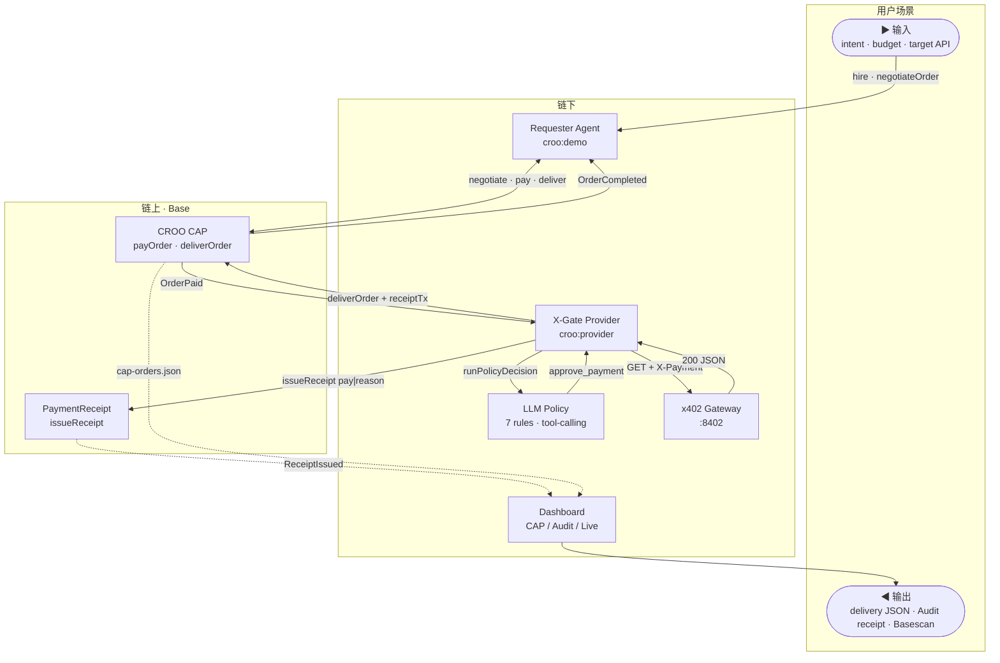
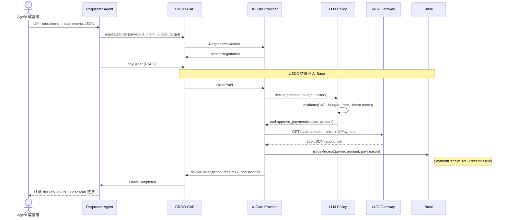

# X-Gate

> **Skip 也会上链。** Agent 拒绝付费时，X-Gate 仍 `deliverOrder` 并写入 PaymentReceipt — 不是只审计成功付款。

[Live Demo](https://x-gate.vercel.app/dashboard)
[Base](https://basescan.org)
[CROO CAP](https://agent.croo.network)
[License](#links--contact)

## AI 帮 Agent 决定：这 0.001 USDC 要不要花

*Hire X-Gate on CROO CAP — LLM pay/skip policy, x402-inspired gateway, on-chain receipts for **both** outcomes.*

**[▶ Open Dashboard](https://x-gate.vercel.app/dashboard)** · **[▶ Demo 视频](#demo)** · **[▶ 5 分钟本地跑通](#demo)**


| CAP Orders                      | Audit · pay & skip          |
| ------------------------------- | --------------------------- |
| CAP Orders — action + receiptTx | Audit — skip 也有 Basescan TX |


### 评委 30 秒验收

- [ ] Agent Store 可见 Active Service（X-Gate Policy Agent）
- [ ] `npm run croo:demo` → 终端 `OrderCompleted`
- [ ] Dashboard → CAP Orders：`action` + `receiptTx`
- [ ] Dashboard → Audit：pay **与** skip 均有 Basescan 链接


| 💸 Pay                   | 🛑 Skip                       | 📊 Audit             |
| ------------------------ | ----------------------------- | -------------------- |
| LLM 批准 → 仿x402 网关 → USDC | LLM 拒绝 → **不调 API**           | Dashboard 三 Tab      |
| 链上 `pay|reason`          | 仍 deliver + `**skip|reason`** | CAP 订单 ↔ Basescan TX |


📎 On-chain proof & quick links


| 资源              | 链接                                                                                                            |
| --------------- | ------------------------------------------------------------------------------------------------------------- |
| Live Demo       | [x-gate.vercel.app](https://x-gate.vercel.app/)                                                               |
| Dashboard       | [x-gate.vercel.app/dashboard](https://x-gate.vercel.app/dashboard)                                            |
| Agent Store     | [agent.croo.network](https://agent.croo.network)                                                              |
| PaymentReceipt  | `[0xA1D7…40d6E` ↗](https://basescan.org/address/0xA1D71Fa6929D9f0605De6548f00c281a2EB40d6E)                   |
| Proof TX · pay  | `[0x2d91…ee28` ↗](https://basescan.org/tx/0x2d910c72213c10d8e5f0c3dfd790d083836f25adeb4206bc517d7400be78ee28) |
| Proof TX · skip | `[0x8778…0d23` ↗](https://basescan.org/tx/0x8778474d9cb940226bca2b60a7822aed24dbc2403276ba2187f15cf5f2380d23) |
| Hackathon       | [CROO Agent Hackathon · DoraHacks](https://dorahacks.io/hackathon/croo-hackathon/buidl)                       |
| Demo 录屏脚本       | [docs/demo-script.md](docs/demo-script.md)                                                                    |


---

## Problem & Solution

**用户是谁**

- Agent 运营者：自主 Agent 批量调付费 API，预算失控、重复请求、skip 决策无法追责。
- API 提供商：流量被白嫖；按次计费 + 风控 infra 自建成本高。

**痛点：** CAP 下单后，「这 0.001 USDC 该不该花」谁负责？行业默认只记成功付款，skip 消失在本地日志。

**X-Gate 解法：** Requester 在 Agent Store 雇佣 X-Gate Policy Agent（`@croo-network/sdk`）。Provider 跑 LLM 7 条策略 → pay 时经 仿x402-inspired 网关 → pay / skip 均 `deliverOrder` + PaymentReceipt。Dashboard 三 Tab，5 秒对照 CAP 订单与链上 receipt。

---

## Demo


| 资产       | 状态                                                 |
| -------- | -------------------------------------------------- |
| Demo 视频  | *录制中 · [docs/demo-script.md](docs/demo-script.md)* |
| Live URL | [x-gate.vercel.app](https://x-gate.vercel.app/)    |


### 本地 5 分钟（主路径 · CAP）

```bash
cd gateway && npm run dev          # T1
cd agent && npm run croo:provider  # T2
cd agent && npm run croo:check && npm run croo:demo   # T3
cd agent && CROO_DEMO_CASE=skip npm run croo:demo     # skip 对照
```

验收：`OrderCompleted` → CAP Orders（`action` + `receiptTx`）→ Audit（pay + skip TX）。

---

## How it Works

### 60 秒读懂

1. **输入：** Requester 提交 `intent · budget · target API`（CAP requirements JSON）。
2. **核心：** Provider 用 LLM 决策 → pay 走 仿x402-inspired 网关 → 两种结果都写 Base `PaymentReceipt`。
3. **输出：** Dashboard 展示 CAP delivery + Basescan TX；skip 路径不调网关，但仍 deliver + receipt。

虚线 = 链上事件/索引；实线 = 链下 HTTP / LLM / 文件日志。

### Architecture




### Core Flow · pay




**skip 差异：** LLM 调用 `decline_payment` → 跳过 Gateway → 仍 `issueReceipt(skip|reason)` + `deliverOrder`。

细节：[docs/architecture.md](docs/architecture.md) · [docs/policy-rules.md](docs/policy-rules.md)

---

## Tech Stack


| 层级       | 技术                                 | Why                                           |
| -------- | ---------------------------------- | --------------------------------------------- |
| Agent 协议 | CROO CAP · `@croo-network/sdk`     | A2A 协商 / 结算 / 交付；Policy Agent 可上架 Agent Store |
| 执行层      | 仿x402-inspired HTTP 402 + verifier | 任意 HTTP API 按路由 micropay；与 CAP 订单解耦           |
| 链        | Base · viem 2 · PaymentReceipt.sol | CROO 同链；Circle USDC；低 gas 适合高频 receipt        |
| 策略       | OpenAI SDK · tool-calling          | 可解释 pay/skip；多条规则可审计                          |
| Web      | Next.js 15 · SSE                   | 三 Tab 实时对照 CAP 与链上事件                          |


### Why Sponsor Stacks


| Sponsor / 生态       | X-Gate 用了什么                                                               | 为什么是它                                                   |
| ------------------ | ------------------------------------------------------------------------- | ------------------------------------------------------- |
| CROO · CAP         | `negotiateOrder` → `payOrder` → `deliverOrder`；双 Agent Provider/Requester | 赛事要求 A2A 可雇佣 Agent；我们补「花钱前策略 + 花钱后 receipt」，不是 scaffold |
| Base · Coinbase L2 | 合约 + CAP USDC + `issueReceipt` 均在 Base                                    | 与 CROO 同链；USDC 原生；评委 5 秒 Basescan 验证                    |
| 仿x402-inspired     | Gateway 返回 402 JSON；`X-Payment` stub/live                                 | HTTP 原生 micropay 标准；Policy Agent 的执行层，可被任意 CAP 消费者复用    |


设计约束：[docs/architecture.md](docs/architecture.md#设计约束)

---

## Why Now · Why Us

Agent 批量调用外部 API；Agent Store 让「雇佣专用 Agent」成为常态。仿x402-inspired 网关让按次 HTTP 付费可行，但缺与 CAP 订单绑定的 Policy + Receipt 标准件。


| 维度      | X-Gate                     | 常见 CAP demo       |
| ------- | -------------------------- | ----------------- |
| skip 处理 | deliver + 链上 `skip|reason` | 仅本地日志 / 无 deliver |
| 定位      | 运行时 spending policy        | 工具链 / scaffold    |
| 验证      | 双 TX 样本 + Dashboard 三 Tab  | 仅终端日志             |


**交付承诺（Grant Council）：** 截止 2026-07-12 前每周 merge + Live / 视频更新 · CAP demo 连续 3 次绿 · typecheck 三 package 通过 · stub 默认，live USDC / CI 在 Roadmap 有日期，不夸大已上线能力。

---

## Roadmap

### Done（已交付 · 可验证）


| 交付物         | 证据                                                                                                                                                                                                               |
| ----------- | ---------------------------------------------------------------------------------------------------------------------------------------------------------------------------------------------------------------- |
| CAP 闭环      | [pay TX ↗](https://basescan.org/tx/0x2d910c72213c10d8e5f0c3dfd790d083836f25adeb4206bc517d7400be78ee28) · [skip TX ↗](https://basescan.org/tx/0x8778474d9cb940226bca2b60a7822aed24dbc2403276ba2187f15cf5f2380d23) |
| 仿x402 + LLM | gateway · 多条规则 · `demo:pitch` · live USDC verifier                                                                                                                                                               |


### Next 4 weeks（2026-06-26 → 2026-07-12）


| 日期    | 里程碑                       | Done 标准                             |
| ----- | ------------------------- | ----------------------------------- |
| 07-05 | Vercel Live + Quick Links | 评委无需 clone 可开 Dashboard             |
| 07-08 | Demo 视频 ≤3min             | DoraHacks 表单可嵌入                     |
| 07-10 | GitHub Actions CI         | typecheck + web build + CAP smoke 绿 |
| 07-11 | OpenClaw skill            | 赛事 OpenClaw tag 可复现                 |
| 07-12 | BUIDL 提交                  | GitHub + 视频 + Live 三链一致             |


### 3–6 months（post-hackathon）

- Q3 2026：`AGENT_DEMO_MODE=live` 文档化 · 多网络 `NETWORK` env
- Q3–Q4：可配置 policy pack · 多租户 Provider 模板
- Q4：E2E CI（CAP + x402基建）· 第三方安全审计 gate 主网

---

## Links & Contact


| 资源               | 链接                                                                          |
| ---------------- | --------------------------------------------------------------------------- |
| CROO Agent Store | [agent.croo.network](https://agent.croo.network)                            |
| CROO 协议          | [croo.network](https://croo.network)                                        |
| Base Explorer    | [basescan.org](https://basescan.org/)                                       |
| x402             | [x402.org](https://www.x402.org/)                                           |
| DoraHacks BUIDL  | [croo-hackathon/buidl](https://dorahacks.io/hackathon/croo-hackathon/buidl) |
| 文档索引             | [docs/README.md](docs/README.md)                                              |
| 本地搭建             | [docs/setup.md](docs/setup.md)                                              |
| 环境变量             | [docs/env-reference.md](docs/env-reference.md)                              |


**Contact：** GitHub Issues · DoraHacks **X-Gate Policy Agent** 

**License：** MIT · stub 默认 · 非生产就绪