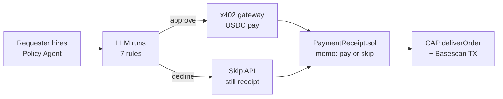
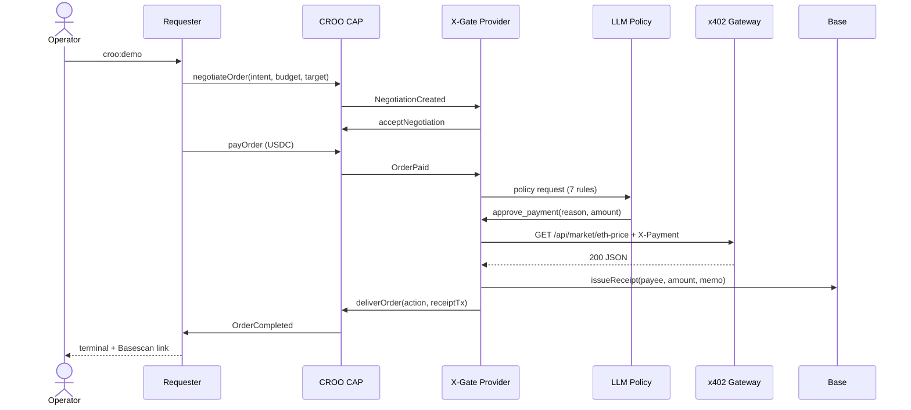

# X-Gate

### Project at a Glance

**X-Gate** is a hireable CROO CAP Policy Agent: an LLM approves or skips each micropayment API call, then writes **both outcomes** to Base via `PaymentReceipt.sol`.  
**7** spending rules · **2** live Basescan proofs (pay + skip) · judges verify the full loop in **30 seconds** — no clone required.

**[Live Dashboard](https://x-gate.vercel.app/dashboard)** · **[On-chain proof](https://basescan.org/address/0xA1D71Fa6929D9f0605De6548f00c281a2EB40d6E)** · **[Agent Store](https://agent.croo.network)** · **[Demo video (3 min)](https://www.youtube.com/watch?v=3FjqHpVtEpM)**

> **Who owns a “no”?** Most stacks log successful payments only. X-Gate records **pay and skip** on Base — every **$0.001** decision traceable.

---

## 30-Second Judge Checklist

```bash
npm run croo:demo          # terminal → OrderCompleted
open https://x-gate.vercel.app/dashboard
```

- [ ] **Agent Store:** Active service **X-Gate Policy Agent**
- [ ] **Terminal:** `OrderCompleted` + delivery JSON (`action`, `receiptTx`, `capOrderId`)
- [ ] **CAP Orders tab:** `action` + clickable `receiptTx`
- [ ] **Audit tab:** **Pay and skip** both link to Basescan

---

## 2 Paths, 2 Receipts (Core Demo)

| Path | What happens | Proof |
| --- | --- | --- |
| **Pay** | LLM approves → x402-inspired gateway → USDC → API JSON | [Pay TX ↗](https://basescan.org/tx/0x2d910c72213c10d8e5f0c3dfd790d083836f25adeb4206bc517d7400be78ee28) |
| **Skip** | LLM declines → **no gateway call** → still `deliverOrder` + receipt | [Skip TX ↗](https://basescan.org/tx/0x8778474d9cb940226bca2b60a7822aed24dbc2403276ba2187f15cf5f2380d23) |

**Why it matters:** Autonomous agents hammer paid APIs. Budget overruns, duplicate calls, and silent “no” decisions vanish in local logs. X-Gate ties **CAP delivery** to **Basescan** in one dashboard — ~5 seconds to cross-check.

---

## Problem → Fix

**Who feels the pain**

- **Agent operators** — runaway spend, no audit trail when the LLM skips
- **API providers** — unpaid traffic; roll-your-own billing is expensive

**The blind spot:** After a CAP order, nobody owns “should we spend this $0.001?” Industry default: **log pays, forget skips.**

**X-Gate in 3 steps**



1. **LLM policy** — 7 rules (budget, rate limit, cooldown, intent match…) via tool-calling  
2. **x402-inspired gateway** — route-priced HTTP 402; decoupled from CAP settlement  
3. **On-chain receipt** — pay **and** skip on Base; 3-tab dashboard (Live / Audit / CAP)

---

## Industry Context: x402 & the Agent-First Web

In July 2026, [Cloudflare announced the Monetization Gateway](https://blog.cloudflare.com/monetization-gateway/) — x402 micropayments at the edge for APIs, datasets, and MCP tools. That validates the shift from subscriptions to **per-request agent commerce**: stablecoin settlement, HTTP 402 as the price signal, and **payment as credential** (no signup or API key required).

**Cloudflare answers:** *"How do I charge for my API?"*  
**X-Gate answers:** *"How does an autonomous agent decide whether to pay, consume the resource, and prove what it did?"*

| Layer | Cloudflare Monetization Gateway | X-Gate |
| --- | --- | --- |
| **Protocol** | x402 (402 → pay → retry with proof) | Same x402-inspired flow |
| **Role** | Seller-side edge enforcement | **Buyer-side policy agent** + CAP orchestration |
| **Deployment** | Cloudflare global network (waitlist) | Self-hosted gateway (Railway, local, etc.) |
| **Agent intelligence** | Assumes the buyer pays when priced | **LLM pay/skip** under budget, rate limits, intent rules |
| **Order flow** | Single HTTP transaction | **CROO CAP:** negotiate → pay → policy → deliver |
| **Audit** | Platform verification | **On-chain PaymentReceipt** for pay **and** skip |

```text
┌─────────────────────────────────────────┐
│  CROO CAP (agent marketplace)           │  ← X-Gate
│  negotiate → payOrder → deliver         │
├─────────────────────────────────────────┤
│  Policy Agent (LLM pay / skip)          │  ← X-Gate
├─────────────────────────────────────────┤
│  x402 Gateway (402 / verify / serve)    │  ← Cloudflare MG · X-Gate gateway
└─────────────────────────────────────────┘
```

We are not competing with CDN-scale infrastructure. X-Gate is an **open, composable reference stack** for the layer above x402: policy, CAP delivery, and Basescan-auditable decisions. Today's self-hosted gateway is a demo slice; the **policy + receipt layer stays the same** if the execution layer moves to Cloudflare (or any x402 gateway) later.

---

## Run It in 5 Minutes

| Asset | Link |
| --- | --- |
| Live Dashboard | [x-gate.vercel.app/dashboard](https://x-gate.vercel.app/dashboard) |
| Demo video | [YouTube · 3 min](https://www.youtube.com/watch?v=3FjqHpVtEpM) |

```bash
# T1 — x402 gateway
cd gateway && npm run dev

# T2 — CAP provider (long-running)
cd agent && npm run croo:provider

# T3 — pay path
cd agent && npm run croo:check && npm run croo:demo

# skip path (contrast)
cd agent && CROO_DEMO_CASE=skip npm run croo:demo
```

**Pass criteria:** `OrderCompleted` → CAP Orders (`action` + `receiptTx`) → Audit ([pay](https://basescan.org/tx/0x2d910c72213c10d8e5f0c3dfd790d083836f25adeb4206bc517d7400be78ee28) + [skip](https://basescan.org/tx/0x8778474d9cb940226bca2b60a7822aed24dbc2403276ba2187f15cf5f2380d23)).

**Optional (no CAP):** `npm run demo:pitch` from repo root — x402 + LLM scenarios only. See [docs/x402-demo.md](docs/x402-demo.md).

---

## Architecture

### System overview


Dashed = chain events / file index · Solid = HTTP / LLM · Green = core innovation

### Pay sequence (skip omits gateway)



**Skip delta:** `decline_payment` → skip gateway → still `issueReceipt(skip|reason)` + `deliverOrder`.

Deep dive: [docs/architecture.md](docs/architecture.md) · [docs/policy-rules.md](docs/policy-rules.md)

---

## Tech Stack

| Layer | Choice | Why |
| --- | --- | --- |
| Agent protocol | CROO CAP · `@croo-network/sdk` | Hire Provider on Agent Store; A2A negotiate / pay / deliver |
| Execution | x402-inspired HTTP 402 + verifier | Per-route micropay on any HTTP API |
| Chain | Base · viem 2 · PaymentReceipt.sol | Same chain as CAP USDC; cheap receipts at volume |
| Policy | OpenAI-compatible SDK · tool-calling | Explainable pay/skip; auditable rules |
| Web | Next.js 15 · SSE | 3 tabs: Live traffic vs CAP orders vs chain |

### Sponsor stacks (what we actually ship)

| Sponsor | X-Gate uses | Why this stack |
| --- | --- | --- |
| **CROO · CAP** | `negotiateOrder` → `payOrder` → `deliverOrder` (dual Agent keys) | Hackathon A2A hire path + we add **pre-spend policy + post-spend receipt** |
| **Base** | Contract + CAP USDC + `issueReceipt` on Base | Judges verify on Basescan in ~5 seconds |
| **x402-inspired** | Gateway 402 JSON · `X-Payment` stub/live | Standard HTTP micropay execution layer |

Constraints: [docs/architecture.md#设计约束](docs/architecture.md#设计约束) — no DB, stub default, three independent npm packages.

---

## Why X-Gate (vs typical CAP demo)

| | X-Gate | Typical CAP demo |
| --- | --- | --- |
| **Skip** | `deliverOrder` + on-chain `skip\|reason` | Local log only |
| **Role** | Runtime spending policy agent | Scaffold / tooling |
| **Proof** | 2 TX samples + 3-tab dashboard | Terminal output |

**Timing:** Cloudflare's Monetization Gateway (Jul 2026) confirms x402 is productizing. Agents already batch-call paid APIs; Agent Store makes “hire a specialist” real. **CAP still lacks a policy + receipt bundle** sitting above any x402 gateway — X-Gate ships that bundle.

---

## Roadmap

### Shipped (verify today)

| Deliverable | Evidence |
| --- | --- |
| CAP loop | [Pay TX ↗](https://basescan.org/tx/0x2d910c72213c10d8e5f0c3dfd790d083836f25adeb4206bc517d7400be78ee28) · [Skip TX ↗](https://basescan.org/tx/0x8778474d9cb940226bca2b60a7822aed24dbc2403276ba2187f15cf5f2380d23) |
| x402 + LLM | Gateway · 7 rules · `demo:pitch` · live USDC verifier |

### Next 4 weeks (Jun 26 → Jul 12, 2026)

| Date | Milestone | Done when |
| --- | --- | --- |
| 07-05 | Vercel Live | Judges open Dashboard without cloning |
| 07-08 | Demo video ≤3 min | Embedded in DoraHacks form |
| 07-10 | GitHub Actions CI | typecheck + web build + CAP smoke green |
| 07-11 | OpenClaw skill | Reproducible under hackathon tag |
| 07-12 | BUIDL submit | GitHub + video + Live URLs aligned |

### 3–6 months (post-hackathon)

- Q3 2026: Document `AGENT_DEMO_MODE=live` · multi-network `NETWORK` env  
- Q3–Q4: Configurable policy packs · multi-tenant Provider template  
- Q4: E2E CI (CAP + x402) · third-party audit before mainnet hardening  

---

## Links

| Resource | URL |
| --- | --- |
| Live Demo | [x-gate.vercel.app](https://x-gate.vercel.app/) |
| Dashboard | [x-gate.vercel.app/dashboard](https://x-gate.vercel.app/dashboard) |
| PaymentReceipt | [`0xA1D7…40d6E` ↗](https://basescan.org/address/0xA1D71Fa6929D9f0605De6548f00c281a2EB40d6E) |
| Pay TX | [`0x2d91…ee28` ↗](https://basescan.org/tx/0x2d910c72213c10d8e5f0c3dfd790d083836f25adeb4206bc517d7400be78ee28) |
| Skip TX | [`0x8778…0d23` ↗](https://basescan.org/tx/0x8778474d9cb940226bca2b60a7822aed24dbc2403276ba2187f15cf5f2380d23) |
| CROO Agent Store | [agent.croo.network](https://agent.croo.network) |
| CROO Protocol | [croo.network](https://croo.network) |
| Base Explorer | [basescan.org](https://basescan.org/) |
| x402 | [x402.org](https://www.x402.org/) |
| Cloudflare Monetization Gateway | [blog announcement ↗](https://blog.cloudflare.com/monetization-gateway/) |
| DoraHacks BUIDL | [croo-hackathon/buidl](https://dorahacks.io/hackathon/croo-hackathon/buidl) |

**Docs:** [docs/README.md](docs/README.md) · [setup](docs/setup.md) · [env](docs/env-reference.md) · [demo script](docs/demo-script.md)

---

## Contact & License

**Contact:** GitHub Issues · DoraHacks **X-Gate Policy Agent**  
**License:** MIT © 2026 [rgtanga](https://github.com/rgtanga) · stub default · **not production-ready**

---

**Built for CROO Agent Hackathon** · [DoraHacks BUIDL](https://dorahacks.io/hackathon/croo-hackathon/buidl) · 2026
