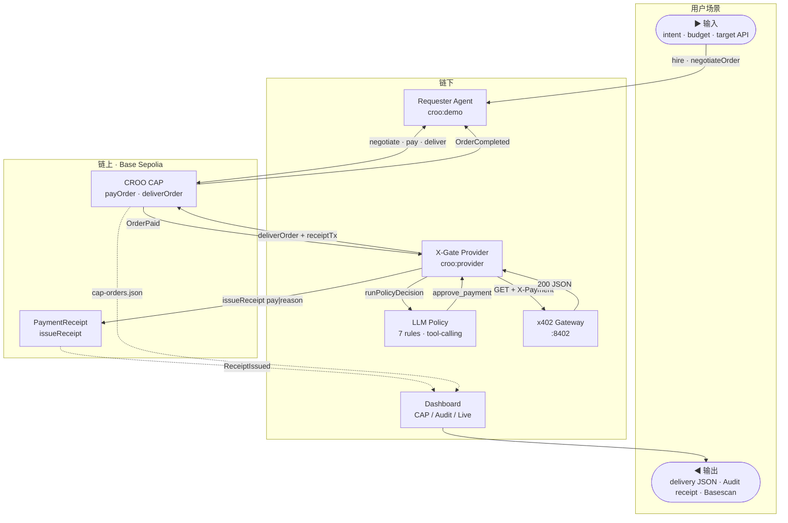
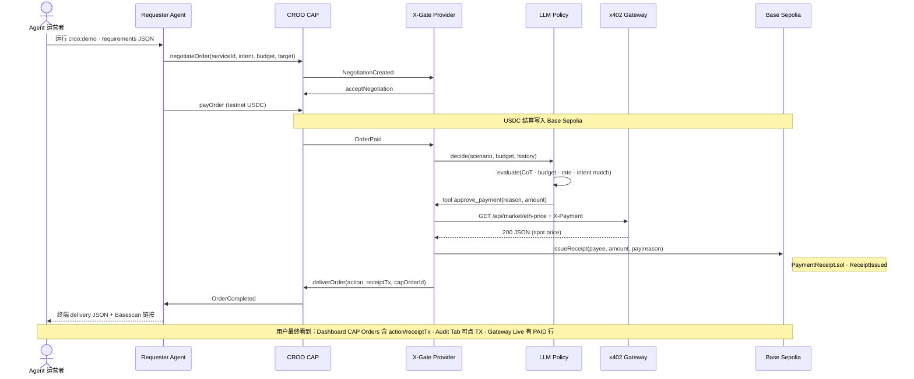

# **X-Gate** · Agent Store 上的 API Spending Policy

> **评委 30 秒结论：** Agent 拒绝付费（skip）也会 `deliverOrder` + 写 Base Sepolia receipt——不是只审计成功付款。  
> **主路径已可跑：** `croo:demo` → `OrderCompleted` → Dashboard 可点 [0xc864…0d1e](https://sepolia.basescan.org/tx/0xc86492a7ecd10c03f34e0863717bac109f28f2b07602cd43fce2fa263f5b0d1e)（pay）与 [0x42ff…7971](https://sepolia.basescan.org/tx/0x42ffbb87101d04bcfa6ca320b9e97f98f47ccca849e4f1433cc533626f627971)（skip）。

## 1 · One-liner + Quick Links 🎯

**One-liner（中文）：** 在 **CROO CAP** 上可雇佣的 Policy Agent——LLM 决策 pay / skip，仿**x402** 网关执行，**Base Sepolia** 链上审计两种结果。  
**One-liner（EN）：** Hire **X-Gate** on CROO CAP — LLM pay/skip policy, **x402** execution, verifiable receipts on **Base Sepolia** (pay **and** skip).


|                           | 链接                                                                                                                                                                                       |
| ------------------------- | ---------------------------------------------------------------------------------------------------------------------------------------------------------------------------------------- |
| **Live Demo**             | [https://x-gate.vercel.app/](https://x-gate.vercel.app/)                                                                                                                                 |
| **Demo 视频**               | *DoraHacks 提交前更新 — 脚本见 [docs/demo-script.md](docs/demo-script.md)*                                                                                                                       |
| **Dashboard**             | [https://x-gate.vercel.app/dashboard](https://x-gate.vercel.app/)                                                                                                                        |
| **Agent Store · Service** | [agent.croo.network](https://agent.croo.network)                                                                                                                                         |
| **PaymentReceipt**        | [https://basescan.org/address/0xA1D71Fa6929D9f0605De6548f00c281a2EB40d6E](https://basescan.org/address/0xA1D71Fa6929D9f0605De6548f00c281a2EB40d6E)                                       |
| **Proof TX · pay**        | [https://basescan.org/tx/0x2d910c72213c10d8e5f0c3dfd790d083836f25adeb4206bc517d7400be78ee28](https://basescan.org/tx/0x2d910c72213c10d8e5f0c3dfd790d083836f25adeb4206bc517d7400be78ee28) |
| **Proof TX · skip**       | [https://basescan.org/tx/0x8778474d9cb940226bca2b60a7822aed24dbc2403276ba2187f15cf5f2380d23](https://basescan.org/tx/0x8778474d9cb940226bca2b60a7822aed24dbc2403276ba2187f15cf5f2380d23) |
| **Hackathon**             | [CROO Agent Hackathon · DoraHacks](https://dorahacks.io/hackathon/croo-hackathon/buidl)                                                                                                  |


**30 秒验收清单**

- [ ] Agent Store 可见 Active Service（**X-Gate Policy Agent**）
- [ ] `npm run croo:demo` → 终端 `OrderCompleted`
- [ ] Dashboard → CAP Orders：`action` + `receiptTx`
- [ ] Dashboard → Audit：pay **与** skip 均有 Basescan 链接

---

## 2 · The Problem & The Solution 💡

### 用户是谁

**Agent 运营者**：自主 Agent 批量调付费 API，预算失控、重复请求、skip 决策无法追责。  
**API 提供商**：流量被白嫖；按次计费 + 风控 infra 自建成本高。

### 痛点

CAP 下单后，「这 0.001 USDC 该不该花」谁负责？行业默认只记成功付款，**skip 消失在本地日志**。

### **X-Gate** 解法

Requester 在 Agent Store 雇佣 **X-Gate Policy Agent**（**@croo-network/sdk**）。  
Provider 跑 LLM 7 条策略 → pay 时经 **x402** 网关 → pay / skip 均 `deliverOrder` + **PaymentReceipt**。  
Dashboard 三 Tab，5 秒对照 CAP 订单与链上 receipt。

---

## 3 · Demo 🎬

### 视频 & 在线体验


| 资产       | 状态                                                       |
| -------- | -------------------------------------------------------- |
| Demo 视频  | *录制中 · [docs/demo-script.md](docs/demo-script.md)*       |
| Live URL | [https://x-gate.vercel.app/](https://x-gate.vercel.app/) |


### 本地 5 分钟（主路径 · CAP）

```bash
cd gateway && npm run dev          # T1
cd agent && npm run croo:provider  # T2
cd agent && npm run croo:check && npm run croo:demo   # T3
cd agent && CROO_DEMO_CASE=skip npm run croo:demo     # skip 对照
```

**验收：** `OrderCompleted` → CAP Orders（`action` + `receiptTx`）→ Audit（pay + skip TX）。

### 截图


| 画面           | 路径                           |
| ------------ | ---------------------------- |
| CAP Orders   | `docs/assets/cap-orders.png` |
| Audit · skip | `docs/assets/audit-skip.png` |


---

## 4 · How it Works ⚙️

### 60 秒读懂（先看这三条）

1. **输入：** Agent 运营者通过 Requester 提交 `intent · budget · target API`（CAP requirements JSON）。
2. **核心：** Provider 用 LLM 决策 → pay 走仿 **x402** 网关 → 两种结果都写 **Base** `PaymentReceipt`。
3. **输出：** Dashboard 展示 CAP delivery + Basescan TX；skip 路径不调网关，但仍 deliver + receipt。

**边界：** 虚线 = 链上事件/索引；实线 = 链下 HTTP / LLM / 文件日志。

### 架构（Architecture · flowchart）




### 核心流程（Core Flow · pay · sequenceDiagram）




**skip 差异（一行）：** LLM 调用 `decline_payment` → 跳过 Gateway → 仍 `issueReceipt(skip|reason)` + `deliverOrder`。

细节：[docs/architecture.md](docs/architecture.md) · [docs/policy-rules.md](docs/policy-rules.md)

---

## 5 · Tech Stack 🛠


| 层级       | 技术                                                 | Why                                           |
| -------- | -------------------------------------------------- | --------------------------------------------- |
| Agent 协议 | **CROO CAP** · **@croo-network/sdk**               | A2A 协商 / 结算 / 交付；Policy Agent 可上架 Agent Store |
| 执行层      | **仿x402** HTTP 402 + verifier                      | 任意 HTTP API 按路由 micropay；与 CAP 订单解耦           |
| 链        | **Base Sepolia** · viem 2 · **PaymentReceipt.sol** | CROO 同链；Circle USDC；低 gas 适合高频 receipt        |
| 策略       | OpenAI SDK · tool-calling                          | 可解释 pay/skip；多条规则可审计                          |
| Web      | Next.js 15 · SSE                                   | 三 Tab 实时对照 CAP 与链上事件                          |


### Why Sponsor Stacks（为何用这些栈，而非替代方案）


| Sponsor / 生态           | **X-Gate** 用了什么                                                           | 为什么是它                                                   |
| ---------------------- | ------------------------------------------------------------------------- | ------------------------------------------------------- |
| **CROO · CAP**         | `negotiateOrder` → `payOrder` → `deliverOrder`；双 Agent Provider/Requester | 赛事要求 A2A 可雇佣 Agent；我们补「花钱前策略 + 花钱后 receipt」，不是 scaffold |
| **Base · Coinbase L2** | 合约 + CAP USDC + `issueReceipt` 均在 **Base Sepolia**                        | 与 CROO 同链；USDC 原生；评委 5 秒 Basescan 验证                    |
| **仿x402**              | Gateway `:8412` 返回 402 JSON；`X-Payment` stub/live                         | HTTP 原生 micropay 标准；Policy Agent 的执行层，可被任意 CAP 消费者复用    |


设计约束：[docs/architecture.md](docs/architecture.md#设计约束)

---

## 6 · Why Now + Why Us 🚀

### Why Now

Agent 批量调用外部 API；Agent Store 让「雇佣专用 Agent」成为常态。  
仿**x402网关** 让按次 HTTP 付费可行，但缺与 CAP 订单绑定的 **Policy + Receipt** 标准件。

### Why Us · 差异化


| 维度      | **X-Gate**                | 常见 CAP demo    |
| ------- | ------------------------- | -------------- |
| skip 处理 | deliver + 链上 `skip        | reason`        |
| 定位      | 运行时 spending policy       | 工具链 / scaffold |
| 验证      | 双 TX 样本 + Dashboard 三 Tab | 仅终端日志          |


### 团队与交付承诺（Grant Council）

- **维护节奏：** 截止 2026-07-12 前每周 merge + Quick Links 更新（Live / 视频）。  
- **公开指标：** CAP demo 连续 3 次绿 · typecheck 三 package 通过 · Audit 可点 Basescan。  
- **Scope 诚实：** testnet + stub 默认；live USDC / CI 在 Roadmap 有日期，不夸大已上线能力。

---

## 7 · Roadmap 🗺

### Done（已交付 · 可验证）


| 交付物         | 证据                                                                                                                                                                                                                                                                                                                                       |
| ----------- | ---------------------------------------------------------------------------------------------------------------------------------------------------------------------------------------------------------------------------------------------------------------------------------------------------------------------------------------- |
| CAP 闭环      | [0x2d910c72213c10d8e5f0c3dfd790d083836f25adeb4206bc517d7400be78ee28](https://basescan.org/tx/0x2d910c72213c10d8e5f0c3dfd790d083836f25adeb4206bc517d7400be78ee28)pay·[0x8778474d9cb940226bca2b60a7822aed24dbc2403276ba2187f15cf5f2380d23](https://basescan.org/tx/0x8778474d9cb940226bca2b60a7822aed24dbc2403276ba2187f15cf5f2380d23)skip |
| 仿x402 + LLM | gateway · 多条规则 · `demo:pitch`                                                                                                                                                                                                                                                                                                            |


### Next 4 weeks（2026-06-26 → 2026-07-12 · 提交硬 deadline）


| 日期    | 里程碑                       | Done 标准                             |
| ----- | ------------------------- | ----------------------------------- |
| 07-05 | Vercel Live + Quick Links | 评委无需 clone 可开 Dashboard             |
| 07-08 | Demo 视频 ≤3min             | DoraHacks 表单可嵌入                     |
| 07-10 | GitHub Actions CI         | typecheck + web build + CAP smoke 绿 |
| 07-11 | OpenClaw skill            | 赛事 OpenClaw tag 可复现                 |
| 07-12 | BUIDL 提交                  | GitHub + 视频 + Live 三链一致             |


### 3–6 months（post-hackathon · 若获 Grant 延续）

- Q3 2026：Gateway live USDC verifier + `AGENT_DEMO_MODE=live` 文档化  
- Q3–Q4：可配置 policy pack · 多租户 Provider 模板  
- Q4：E2E CI（CAP + **x402基建**）· 第三方安全审计 gate 主网

---

## 8 · Links + Contact + License 📎


| 资源               | 链接                                                                          |
| ---------------- | --------------------------------------------------------------------------- |
| CROO Agent Store | [agent.croo.network](https://agent.croo.network)                            |
| CROO 协议          | [croo.network](https://croo.network)                                        |
| **Base**         | [Base (ETH) Blockchain Explorer (basescan.org)](https://basescan.org/)      |
| **x402**         | [x402.org](https://www.x402.org/)                                           |
| DoraHacks BUIDL  | [croo-hackathon/buidl](https://dorahacks.io/hackathon/croo-hackathon/buidl) |
| 本地搭建             | [docs/setup.md](docs/setup.md)                                              |
| Demo 录屏脚本        | [docs/demo-script.md](docs/demo-script.md)                                  |


**Contact：** GitHub Issues · DoraHacks **X-Gate Policy Agent** · *（Telegram / X 提交前补）*  
**License：** MIT · **Base Sepolia** testnet · stub 默认 — **非生产就绪**。